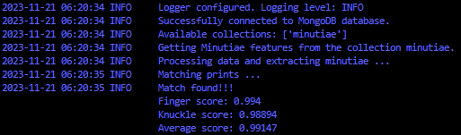
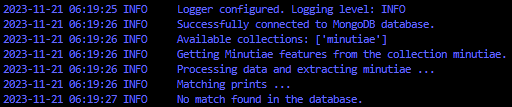

# Finger_and_Knuckle_Print_Matching
A finger and knuckle print matching algorithm. the algorithm uses both finger and knuckle prints to identify an individual. The finger and knuckle prints are passed through `minutiae_feature_extraction`. The minutiae feature of the input finger is compared with the available data in the MongoDB collection `minutiae` and the fussion score calculated. The score threshold is set at **90%** for both finger and knuckle prints to pass the detetction algorithm.

## Run instructions
Provide the path with the knuckle and finger prints to be matched as input arguments to the `run` function in the `main.py` script. In the `run` function, the argument **upload_db** is set to False by default. This prevents the data upload to the database in situation where there was no match found in the database, unless set to True, which updates the database instead.

## Files
- **calculate_fusion_score:** A script to calculate the fusion/matching score between two finger/knuckle prints minutiae.
- **database_connection.py:** Creates a connection to the specified database and collection. The MongoDB database and collection used in this case are **finger_knuckle_prints** and **minutiae** as shown below.
- **logger:** Logger script.
- **minutiae_feature_extraction:** Extracts finger and knuckle print minutiae from the provided data ans returns a numpy n-dimensional array containing the details of the print. This data can eithe rbe uploaded to the dtabase collection as an initial data or used to perform a check for a match in the database.
- **main.py:** Runs the finger and knuckle print matching algorithm.
- **initial_data_load-to_db.py:** A script to perform an initial data load to the MongoDB collection.

## Flow diagram
The flow diagram is as attached below:

## MongoDB setup

## Finger and Knuckle Print Pass

## Finger and Knuckle print fail

